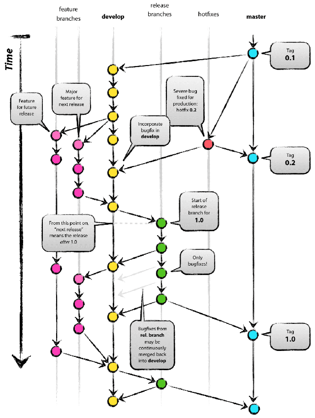

# Start-From-Here

> 一些需要了解的规范，养成良好的习惯，受用一生

# 首先要有一个趁手的兵器：

1. [IntelliJ IDEA](http://www.jetbrains.com/idea/#chooseYourEdition)（Java IDE）：因为咱们的后台是Java，所以这个是必须的；

    > [Tomcat 9](http://tomcat.apache.org/download-90.cgi) 配合IDEA；
    
    > [JDK1.8](http://www.oracle.com/technetwork/java/javase/downloads/jdk8-downloads-2133151.html) 配合IDEA；
    
2. [VS Code](https://code.visualstudio.com/)：推荐这个，自带git、hint、debug、内嵌terminal，主题也很好看；
3. [Git Bash](https://git-for-windows.github.io/)（for windows）; 
4. [SourceTree](https://www.sourcetreeapp.com/);

# 一、先说最重要的代码：

### 命名：

1. 具有较好的语义化：能够让同事容易的理解你的文件、文件夹、变量、函数、对象是干什么的（良好的命名能够节省写文档的时间）；
2. 命名采用驼峰式命名，命名用英文释义，【不要用中文拼音】，英文单词尽量不要简写：
    
    > example：

    > 函数名：createNonceStr(), getHomeTopNews(), parseUrlParams(), makeInstantArticleObject(), reRenderWholePage()
    
    > 变量名：imgRatio, preload_imgs, preloadImgs, temp_ele, tempEle...*变量名至少在作用域内保证语义性*

### Javascript:

1. ES5 + ES6（Babel）：项目都是用 [Gulp](http://www.gulpjs.com.cn/) 或者 [Webpack](https://webpack.js.org/guides/get-started/) 打包，所以可以用一些 [ES6](http://es6.ruanyifeng.com/) 的特性；
2. 编写模块（[React](https://facebook.github.io/react/) 模块）尽量保证功能的单一和可复用性；

### CSS：

1. CSS 预编译器用的是基于Node.js的 [Stylus](http://stylus-lang.com/)，灵活的语法，而且包含一些有用的库 [Nib](http://tj.github.io/nib/);
2. 避免嵌套过深，保证良好的可读性；

### HTML：

1. 尽量使用语义化标签，\<header\> \<footer\>;
2. 样式(css)控制用 class 属性，行为(js)控制用 id 属性；

### 注释：

```javascript
// 这是一条变量或语句的注释
var who = 'me';
for(){}


／**
  * 这是一个模块或功能函数的注释
  *／
var ctx = this;
var getHomeNewsData = ()=>{
    ....
}
```

# 二、项目管理和开发流程：

### 项目管理：
1. 由 [Git](http://www.liaoxuefeng.com/wiki/0013739516305929606dd18361248578c67b8067c8c017b000/) 进行版本控制，所有的项目需要放在 [Gitlab](http://gitlab.cctvnews.cn) 上；
2. Git客户端推荐使用 SourceTree；
3. 使用 Git-flow 进行版本迭代中的新功能开发或bug修复；

### 开发流程：
1. 从 [Gitlab](http://gitlab.cctvnews.cn) 上克隆代码；
2. 根据分到的需求，确定好自己的任务，进行开发；
3. Git提交代码（尽量提交完备的Commit信息）；
4. 提测、bug修复；
5. Code Review；
6. 部署上线；

**Git项目开发流程如下：**


# 三、你可能需要上的网站：

1. [Git简明教程](http://www.bootcss.com/p/git-guide/);
2. [Can i use](http://caniuse.com/);
3. [Mozilla](https://developer.mozilla.org/en-US/);

# 四、你需要知道的：

1. 禁止将公司项目代码公开，禁止上传到Github等开源社区；
2. 但我们鼓励分享，可以将自己写的框架或者插件与大家分享并开源；

